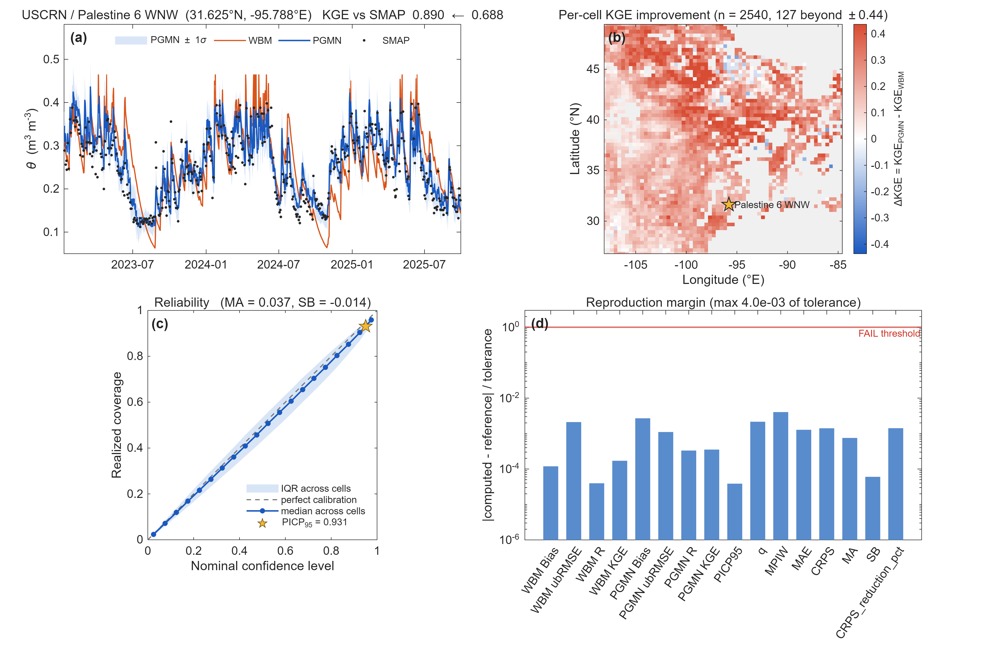

# PGMN: Physics-Guided Mixture Density Network for SMAP soil moisture

Reproducible MATLAB pipeline that pairs a Water Balance Model (WBM) baseline
with a mixture-density ConvLSTM residual learner to reconstruct daily SMAP
surface soil moisture on the EASE-Grid 2.0 Global M36 grid (36 km, equal-area).

The network does not predict soil moisture. It predicts the **distribution of
the WBM residual**, and the reconstruction is

$$\theta^{\mathrm{rec}}_t=\theta^{\mathrm{WBM}}_t-\hat{\varepsilon}_t$$

so the result inherits the water balance and arrives with a predictive spread
rather than a bare number (§2). This repository ships **one 64×64 patch over the
central United States** and the **trained model for that patch**, so the
evaluation-period accuracy *and* the calibration diagnostics can be reproduced
end-to-end for that patch in under a minute, against the values the authors'
production evaluation recorded for it. The paper's headline numbers are
medians over all 90 patches (55,124 cells); one patch cannot reproduce those,
and §7 puts the two side by side.

> Scope: this is the inference and verification path only. Training the full
> 83-patch global domain, and running the water balance model, are not part of
> this repository. See §3 for what that means in practice.

---

## 1. Quick start

```matlab
>> cd PGMN/matlab

>> checkSystemRequirements     % toolboxes, memory, GPU, shipped files
>> verify_loaded_files         % do the shipped files describe the same patch?
>> runExample_quick            % reproduce  (~8 s CPU, ~7 s GPU)

>> cd ../expected_outputs
>> verify_reproduction         % PASS / FAIL against the production reference

>> cd ../matlab
>> plotReproduction            % the four-panel figure
```

If `verify_reproduction` prints **REPRODUCTION SUCCESS**, all 19 checked
quantities matched the reference within tolerance.

---

## 2. Method

PGMN separates the reconstruction into a physical baseline and a learned
correction. The equations below use the notation of the paper (Section 2);
the last column of the table says where each one lives in this repository.

### 2.1 Water balance baseline

Surface soil moisture $\theta$ (m³ m⁻³) in a cell is advanced one day at a
time from precipitation $P$ (mm day⁻¹) alone:

$$
\theta^{\mathrm{WBM}}_{t+1}=\theta^{\mathrm{WBM}}_{t}+\Delta t\left(\frac{P_{t}}{\Delta Z}-L\left(\theta^{\mathrm{WBM}}_{t}\right)\right)
$$

where $\Delta Z$ (mm) is the effective depth and $L(\theta)$ (day⁻¹) is a
loss rate. $L$ is piecewise: a linear ramp from the lower limit to $p_1$, a
quantile regression on the observed dry-down limbs between $p_1$ and $p_2$
(quantile $\beta$), and a linear extrapolation of slope $\alpha$ from $p_2$
up to the porosity $\phi$, which bounds the state from above. The three
parameters $(\alpha, \Delta Z, \beta)$ are fitted once per cell on the
calibration period only. After calibration the model runs **open loop**: it
never reads a SMAP retrieval again, so the baseline is complete in time by
construction and carries no observational noise. The run starts at the first
valid retrieval of each cell and is back-filled over the days before it.

$P$ is MSWEP V2 daily precipitation (0.1 degree, area-weighted onto the same
M36 grid). Its time index is deliberately not the raw MSWEP calendar day.
SMAP's descending overpass reaches a given cell anywhere between 01 and 23
UTC, while MSWEP accumulates over 00-24 UTC, so the window that separates two
successive retrievals straddles two MSWEP days in a proportion that varies
with longitude. The two products are therefore matched per cell from the SMAP
scan time before the model is run: a cell observed before 12 UTC takes raw
MSWEP day $t$, a cell observed at or after 12 UTC takes raw day $t+1$.
`wbm_simulate.m` states the convention its `precip` argument expects.

### 2.2 Residual and reconstruction

The learner never predicts soil moisture. It predicts the baseline error

$$
\varepsilon_t=\theta^{\mathrm{WBM}}_t-\theta^{\mathrm{SMAP}}_t
$$

and the reconstruction subtracts the predicted residual from the baseline:

$$
\theta^{\mathrm{rec}}_t=\theta^{\mathrm{WBM}}_t-\hat{\varepsilon}_t
$$

Where the correction would drive $\theta^{\mathrm{rec}}_t$ to zero or below,
the baseline value is kept instead.

The input at day $t$ is a four-channel field over the 64 × 64 patch

$$
X_t=\left[P_{t-1}, \theta^{\mathrm{WBM}}_t, \varepsilon_{t-1}, a_{t-1}\right]
$$

Note the subscript on $P$: the channel carries $P_{t-1}$, the rainfall over
the interval that ends at $t$ and therefore the rainfall that produced
$\theta^{\mathrm{WBM}}_t$ through the update in section 2.1. It is not $P_t$,
which by that same equation falls after $t$ and cannot inform $\varepsilon_t$.

where $a_{t-1}\in\{0,1\}$ flags whether a retrieval existed on the previous
day. When it did not, $\varepsilon_{t-1}$ is masked to zero on the normalized
scale (the calibration mean) and $a_{t-1}=0$. The rule is the same in
training and inference, so a gap of any length is handled by the same
forward pass: the residual channel stays masked and the model works from
precipitation, the baseline and the flag alone. The network reads a window
of the last ten days, which is why the first nine days of the evaluation
block are warm-up and not scored.

### 2.3 Mixture density head

Residuals are heteroscedastic and not Gaussian, so the network outputs a
distribution rather than a value. A convolutional encoder, a ConvLSTM core
and a transposed-convolution decoder end in a $3\mathrm{M}$-channel head that
parameterizes a Gaussian mixture at every cell:

$$
p\left(\varepsilon_t\mid X_t\right)=\sum_{m=1}^{\mathrm{M}} w_{m,t}\mathcal{N}\left(\varepsilon_t\mid \mu_{m,t}, \sigma_{m,t}^{2}\right)
$$

with $\sum_m w_{m,t}=1$.

The point prediction is the conditional expectation, and the predictive
spread follows from the law of total variance:

$$
\hat{\varepsilon}_t=\sum_{m} w_{m,t}\mu_{m,t}
$$

$$
\sigma_t^{2}=\sum_{m} w_{m,t}\left[\sigma_{m,t}^{2}+\left(\mu_{m,t}-\hat{\varepsilon}_t\right)^{2}\right]
$$

$\sigma_t$ is the standard deviation attached to every reconstructed value
and is what the calibration diagnostics in §7 are computed on. The weights
are trained by minimizing the negative log-likelihood of the observed
residuals on the training part of the calibration period, on days with a
retrieval only:

$$
\mathrm{NLL}=-\frac{1}{n}\sum_{t: a_t=1}\log\left[p\left(\varepsilon_t\mid X_t\right)\right]
$$

where $n$ is the number of observed residuals in the training part. The
validation part is used for early stopping alone. The number of components
is chosen per patch by the Akaike information criterion on the training
part, $\mathrm{AIC}=2k+2n\cdot\mathrm{NLL}$ with $k$ the number of trainable
weights, searched upward from $\mathrm{M}=2$ and stopped once the improvement
falls below 5 %. The shipped patch uses $\mathrm{M}=2$.

### 2.4 Where each piece lives

| Equation | Role | File |
|---|---|---|
| $\theta^{\mathrm{WBM}}$ update, loss function $L$ | physical baseline | `wbm_forwardSim.m` (`sub_loss`), documentation only; the baseline is shipped in channel 2 |
| dry-down limbs, quantile fit | defines $L$ between $p_1$ and $p_2$ | `wbm_drydown.m`, `wbm_quantreg.m` |
| $(\alpha, \Delta Z, \beta)$ per cell | fitted parameters of the shipped patch | `pretrained/wbm_params_patch21.mat` |
| $X_t$ assembly and masking | four-channel input | `mdn_reconstruct.m` |
| encoder – ConvLSTM – decoder – $3\mathrm{M}$ head | network | `mdn_build_network.m`, `ConvLSTMLayer.m` |
| $w_{m,t}, \mu_{m,t}, \sigma_{m,t}$ from the raw head; $\hat\varepsilon_t$, $\sigma_t$ | mixture head, total variance | `mdn_reconstruct.m` |
| $\theta^{\mathrm{rec}}=\theta^{\mathrm{WBM}}-\hat\varepsilon$, fallback at zero | reconstruction rule | `mdn_reconstruct.m` |
| Bias, ubRMSE, R, KGE per cell | accuracy (Table 5 of the paper) | `metrics.m` |
| PICP, MPIW, $q$, CRPS, MA, SB | calibration of $\sigma_t$ | `uncertainty_metrics.m` |
| NLL, AIC, $\mathrm{M}$ | training and model selection (not run here) | recorded in `pretrained/best_model_M3.mat` → `performance` |

---

## 3. What the pipeline does

```
data/sample_patch.mat ── dequantize ──┐
  XVal   ch1 precip(t)                │
         ch2 WBM(t)   <- the physics  ├─► mdn_reconstruct ─► theta_PGMN, sigma
         ch3 residual(t-1)            │        ▲
  ResAvailVal ch4 obs flag(t-1) ──────┘        │
                                    pretrained/best_model_M3.mat
                                      (mdn_load_model rebuilds the network)
                                               │
                        ┌──────────────────────┴──────────────────────┐
                        ▼                                             ▼
                   metrics.m                              uncertainty_metrics.m
              Bias ubRMSE R KGE, per cell               PICP MPIW q MAE CRPS MA SB
                        └──────────────────┬──────────────────────────┘
                                           ▼
                              outputs/metrics_latest.mat
                                           ▼
              verify_reproduction.m  vs  expected_outputs/metrics_reference.json
```

The WBM baseline is **not** re-simulated. It was produced once, fitted on the
calibration period, and travels inside channel 2 of the sample patch. The four
`wbm_*.m` files are kept as readable documentation of that physics and are
flagged in their headers as off the run path.

---

## 4. Repository layout

```
PGMN/
├── README.md                       ← this file
├── LICENSE                         ← MIT
├── CITATION.cff
├── SETUP_NOTES.md                  ← how the shipped files were generated
├── .gitignore
│
├── data/
│   └── sample_patch.mat            ← 64×64×1004 evaluation block, quantized (14 MB)
│
├── pretrained/
│   ├── best_model_M3.mat           ← trained weights, M = 3 (0.7 MB)
│   └── wbm_params_patch21.mat      ← fitted alpha, Z, beta (documentation)
│
├── matlab/
│   ├── runExample_quick.m          ★ entry point
│   ├── checkSystemRequirements.m
│   ├── verify_loaded_files.m       ← cross-consistency of the shipped files
│   ├── plotReproduction.m
│   │
│   ├── mdn_build_network.m         ┐
│   ├── mdn_load_model.m            │ model: rebuild, restore, run
│   ├── ConvLSTMLayer.m             │
│   ├── mdn_reconstruct.m           ┘
│   │
│   ├── metrics.m                   ┐ scoring
│   ├── uncertainty_metrics.m       │
│   ├── setSeed.m                   ┘
│   │
│   ├── extract_sample_patch.m      ┐ regenerate the shipped files from the
│   ├── extract_wbm_params.m        │ author's archives (see SETUP_NOTES.md);
│   ├── trimBestModel.m             │ not needed by a normal user
│   ├── make_reference.m            ┘
│   │
│   ├── wbm_simulate.m              ┐ the water balance model, kept as
│   ├── wbm_drydown.m               │ documentation. NOT on the run path --
│   ├── wbm_forwardSim.m            │ read wbm_simulate.m's header before
│   └── wbm_quantreg.m              ┘ assuming it replicates production.
│
├── expected_outputs/
│   ├── metrics_reference.json      ← paper reference values and tolerances
│   └── verify_reproduction.m       ← PASS/FAIL checker
│
└── docs/
    └── reproduction_figure.png     ← the figure in §7, from the reference run
```

---

## 5. System requirements

### Reference machine

| Component | Value |
|---|---|
| OS       | Windows Server 2022 Standard |
| CPU      | Intel Xeon, ≥ 16 physical cores |
| RAM      | 256 GB (`runExample_quick` peaks near 3 GB) |
| GPU      | NVIDIA RTX A5000, 24 GB |
| MATLAB   | R2025b |

### What is actually needed

| Component | Value |
|---|---|
| OS       | Windows, Linux, or macOS |
| CPU      | 4 cores |
| RAM      | 8 GB |
| GPU      | not required; CPU inference takes about 8 seconds |
| MATLAB   | R2024a or later |
| Required toolboxes | Deep Learning; Statistics and Machine Learning |
| Optional toolbox   | Parallel Computing (enables the GPU path only) |

No Mapping Toolbox is needed: `plotReproduction.m` draws its map with plain
axes. Run `checkSystemRequirements` to verify your environment.

---

## 6. The shipped patch

| | |
|---|---|
| Patch index | 21 of 90 |
| Grid | EASE-Grid 2.0 Global M36 (36 km, equal-area), 406 × 964 |
| Extent | rows 49–112, columns 193–256 |
| Coordinates | 26.79 – 49.43 °N, −108.11 – −84.59 °E (central United States) |
| Land cells | 3,709 of 4,096 |
| Scored cells | **2,540**: cells the WBM modeled and that carry ≥ 10 paired observations |
| Mixture components | M = 3, selected by AIC |
| Fitted weights | 120,201 stored; k = 119,913 counted for AIC |

This patch runs from the Texas Gulf coast up through the Great Plains to the
northern border. It was chosen because it contains **USCRN / Palestine 6 WNW**
(31.78 °N, −95.72 °E), an ISMN station used in the paper's in-situ comparison,
and because it carries more scored cells than any other patch over the United
States. Panel (a) of the figure shows that cell's own series rather than a
domain average.

### Periods

| | Steps | Dates |
|---|---|---|
| Calibration block | 2,830 | 2015-04-02 – 2022-12-31 |
| ├─ train (fits weights) | 2,255 | |
| └─ valid (early stopping only) | 557 | |
| Evaluation block | 1,004 | 2023-01-01 – 2025-09-30 |
| └─ **scored** | **995** | **2023-01-10 – 2025-09-30** |

The first nine days of the evaluation block are consumed as ConvLSTM warm-up
(the sequence length is 10) and are not scored. Weights are fitted on *train*
only; *valid* decides when to stop; the evaluation block is touched by neither.

---

## 7. Reproduced numbers

**These are the values for the shipped patch (patch 21, 2,540 scored cells),
not the global values in the paper.** The paper's Table 5 and Section 3.3.1
report medians over the whole reconstructed domain of 55,124 cells; the
numbers below are what the same production evaluation recorded for this one
patch, and they are what `verify_reproduction.m` checks against. The
comparison at the end of this section shows how the patch sits relative to
the global medians.

**Every value is a median across the 2,540 scored cells, with the
interquartile range in brackets.** One metric is computed per cell first, then
summarized. Pooling all (cell, day) pairs into a single population would weight
each cell by how often the satellite happened to observe it, which is a
function of orbit geometry rather than of anything scientific, and would treat
adjacent cells as independent. EASE-Grid M36 is equal-area, so the cell median
needs no latitude weighting.

### Accuracy

| | Bias (m³ m⁻³) | ubRMSE (m³ m⁻³) | R | KGE |
|---|---|---|---|---|
| WBM baseline | −0.0042 [−0.011, 0.007] | 0.0595 [0.040, 0.073] | 0.5691 [0.480, 0.647] | 0.4944 [0.376, 0.588] |
| **PGMN** | **0.0002** [−0.005, 0.006] | **0.0395** [0.031, 0.046] | **0.7566** [0.699, 0.808] | **0.7149** [0.647, 0.771] |

The four metrics and their order follow Table 5 of the paper. ubRMSE is the
RMSE after removing the bias, sqrt(RMSE² − Bias²), computed per cell.

Per-cell improvement, median: **ΔKGE = +0.2176**, **ΔubRMSE = −0.0178** (a 30.2 % reduction).

### Predictive distribution

| Metric | Value | IQR | Reading |
|---|---|---|---|
| PICP₉₅ | 0.9305 | [0.902, 0.951] | coverage of the nominal 95 % interval |
| q | 1.0980 | [0.999, 1.203] | √E[(e/σ)²]; 1 means σ is right-sized |
| MPIW | 0.1408 | [0.097, 0.166] | interval width, m³ m⁻³ |
| MA | 0.0373 | [0.021, 0.062] | mean \|coverage − nominal\| over 0.025–0.975 |
| SB | −0.0143 | [−0.052, 0.019] | signed deviation; negative = too narrow |
| MAE | 0.0304 | [0.022, 0.037] | point-prediction error, m³ m⁻³ |
| CRPS | 0.0217 | [0.016, 0.026] | distributional score, m³ m⁻³ |
| CRPS reduction | **28.43 %** | [27.61, 29.14] | per cell, then median |

Two notes on how to read these. **PICP₉₅ alone is weak evidence**: it is one
point on the calibration curve, and a likelihood-trained model landing near
0.95 is partly built in. MA and SB sweep the whole curve and ask whether
coverage tracks the nominal level *everywhere*. SB is −0.014 on this patch:
the intervals run slightly narrower than nominal. **CRPS is compared against
MAE** because CRPS collapses to MAE when the forecast is a point mass, so the
reduction measures what issuing a distribution bought over issuing a number.

### This patch against the paper

| | Patch 21 (this package) | Paper, global (55,124 cells) |
|---|---|---|
| Bias, WBM → PGMN (m³ m⁻³) | −0.004 → +0.000 | −0.006 → −0.000 |
| ubRMSE, WBM → PGMN (m³ m⁻³) | 0.060 → 0.040 | 0.037 → 0.030 |
| R, WBM → PGMN | 0.569 → 0.757 | 0.666 → 0.795 |
| KGE, WBM → PGMN | 0.494 → 0.715 | 0.561 → 0.727 |
| PICP₉₅ | 0.931 | 0.935 |
| q | 1.098 | 1.114 |
| CRPS reduction vs MAE | 28.4 % | 27.6 % |

Every row is the same definition on a different set of cells. The patch's
baseline is weaker than the global median (KGE 0.494 vs 0.561) and its KGE
improvement is larger (+0.218 vs +0.166). The calibration diagnostics sit
within 0.004 (PICP₉₅) and 0.016 (q) of the global values.

### Tolerances

`verify_reproduction.m` checks 19 quantities: three domain counts, eight
accuracy medians (Bias, ubRMSE, R, KGE for the baseline and for PGMN), and
eight calibration medians. Tolerances are absolute and
set from measured spread, not chosen for comfort: the package agrees with the
production evaluation to 7.6 × 10⁻⁶ on GPU, and a CPU-only run moves the
reported medians by at most 1.9 × 10⁻⁵. Most bounds sit 50–100× above that.
PICP₉₅, MA and SB get 5 × 10⁻³ because they are counting statistics and are
quantized at 1/n per cell in a way the continuous metrics are not.

### The figure

`plotReproduction.m` writes `outputs/reproduction_figure.png`. The copy below
(`docs/reproduction_figure.png`) is the run used for the numbers above:



- **(a)** soil moisture at the Palestine 6 WNW cell over the evaluation period:
  SMAP, WBM, PGMN with a ±1σ band;
- **(b)** per-cell ΔKGE across the patch, with that cell marked;
- **(c)** the reliability diagram: nominal against realized coverage, median
  and IQR across cells, with PICP₉₅ marked to show how little of the curve one
  confidence level pins down;
- **(d)** the reproduction margin, \|computed − reference\| ÷ tolerance, on a
  log axis with the failure threshold drawn.

---

## 8. Regenerating the shipped files

`data/sample_patch.mat` and both files in `pretrained/` were extracted from
archives that are not part of this repository. A normal user does not need
this; the shipped files already reproduce everything above. The procedure is in
[`SETUP_NOTES.md`](SETUP_NOTES.md).

---

## 9. Citation

See [`CITATION.cff`](CITATION.cff).

## 10. License

MIT; see [`LICENSE`](LICENSE). The trained weights and the sample patch are
released under the same terms.
